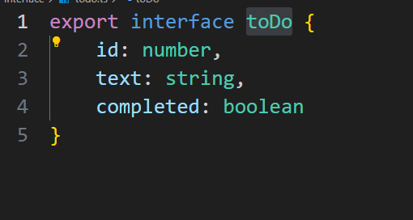
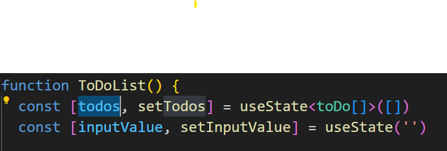
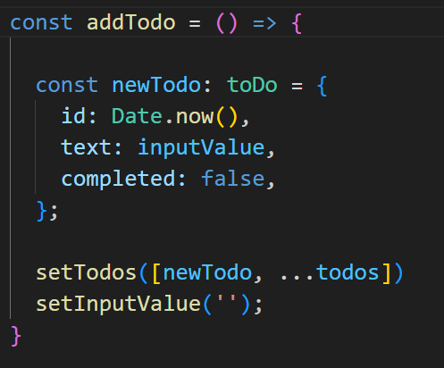
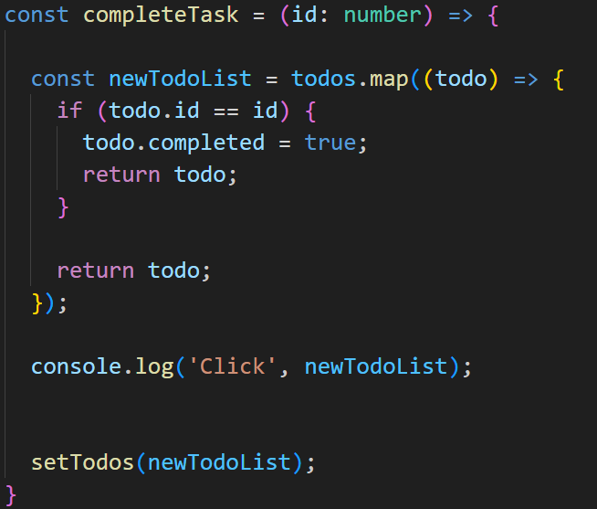

# Ejercicio de To Do List con React

---

## Video Demostrativo

---

## Explicación del código fuente

### 1️ Interface ToDo
se crea una interface toDo que define la estrutura de las tareas
esta esta en la carpeta `./src/interface`

---

### 2️ Componente ToDoList
se crea un Staful Componet llamado ToDoList para manejar la lista de tareas

---

### 3️ Estados del Componente
se usan dos useState:
- **`todos`**: para manejar la lista de tareas
- **`inputValue`**: para controlar un campo de texto

---

### 4️ Función Agregar Tareas
se usa la funcion addTodo para agregar nuevas tareas a la lista usando el setTodos

---

### 5️ Funcion Completar Tareas
la funcion completeTask sirve para marcar las tareas como completadas, recibe como parametro el id de la tarea, realiza un map la lista para buscar y cambiar el estado y settea el nuevo valor de la tarea

